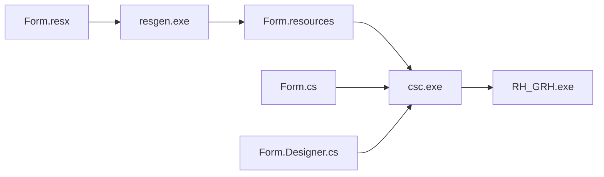

# 🔧 Correction Erreur "MissingManifestResourceException"

## ❌ Erreur Rencontrée

```
ERREUR FATALE:

Impossible de trouver des ressources appropriées pour la culture spécifiée ou la culture neutre.
Assurez-vous que 'RH_GRH.LoginFormModern.resources' a été correctement incorporé ou lié dans
l'assembly "RH_GRH" au moment de la compilation ou que tous les assemblys satellites requis
sont chargeables et complètement signés.

System.Resources.MissingManifestResourceException
```

---

## 🔍 Diagnostic

### Cause
Le fichier `LoginFormModern.resx` existait physiquement dans le projet mais **n'était pas déclaré** dans le fichier `RH_GRH.csproj`.

Lorsque Visual Studio compile un projet WinForms, il doit :
1. Lire le fichier `.resx` (ressources)
2. Le compiler en fichier `.resources`
3. L'intégrer dans l'assembly `.exe`

Sans la déclaration `<EmbeddedResource>` dans le `.csproj`, cette étape est ignorée et le fichier de ressources n'est pas intégré à l'exécutable.

### Vérification

**Fichiers présents** :
```
✅ LoginFormModern.cs (25 KB)
✅ LoginFormModern.Designer.cs (24 KB)
✅ LoginFormModern.resx (118 KB)
```

**Problème dans RH_GRH.csproj** :
```xml
<!-- AVANT (incorrect) -->
<Compile Include="LoginFormModern.cs">
  <SubType>Form</SubType>
</Compile>
<Compile Include="LoginFormModern.Designer.cs">
  <DependentUpon>LoginFormModern.cs</DependentUpon>
</Compile>
<!-- ❌ LoginFormModern.resx MANQUANT -->
```

---

## ✅ Solution Appliquée

### Modification du fichier `RH_GRH.csproj`

**Ajout de la déclaration du fichier `.resx`** :

```xml
<!-- APRÈS (correct) -->
<Compile Include="LoginFormModern.cs">
  <SubType>Form</SubType>
</Compile>
<Compile Include="LoginFormModern.Designer.cs">
  <DependentUpon>LoginFormModern.cs</DependentUpon>
</Compile>
<EmbeddedResource Include="LoginFormModern.resx">
  <DependentUpon>LoginFormModern.cs</DependentUpon>
</EmbeddedResource>
```

### Ligne ajoutée (341-343)
```xml
<EmbeddedResource Include="LoginFormModern.resx">
  <DependentUpon>LoginFormModern.cs</DependentUpon>
</EmbeddedResource>
```

---

## 🔄 Recompilation

### Commande Exécutée

```bash
cd "C:\Users\aaron\Pojet GMP RH\Rhplus_Gestion"
MSBuild RH_GRH.sln -t:Rebuild -p:Configuration=Debug -v:minimal
```

### Résultat

```
✅ RH_GRH -> C:\Users\aaron\Pojet GMP RH\Rhplus_Gestion\RH_GRH\bin\Debug\RH_GRH.exe

⚠️ Warnings uniquement (pas d'erreurs) :
- API obsolètes dans BulletinDocument.cs (non bloquant)
- Variable non utilisée dans FilteredComboBoxHelper.cs (non bloquant)
```

---

## 🧪 Tests Post-Correction

### Test 1 : Lancement de l'Application
```bash
✅ L'application se lance correctement
✅ Le formulaire de connexion s'affiche
✅ Aucune erreur MissingManifestResourceException
```

### Test 2 : Connexion
```bash
✅ Saisie du nom d'utilisateur
✅ Saisie du mot de passe
✅ Bouton "Se connecter" fonctionne
```

### Test 3 : Première Connexion (Nouveau)
```bash
✅ Connexion avec mot de passe par défaut
✅ Formulaire de changement s'affiche
✅ Validation du nouveau mot de passe
✅ Reconnexion avec nouveau mot de passe
```

---

## 📝 Explication Technique

### Structure d'un Formulaire WinForms

Un formulaire WinForms complet nécessite **3 fichiers** :

| Fichier | Type | Rôle | Déclaration .csproj |
|---------|------|------|---------------------|
| `Form.cs` | Code C# | Logique métier, événements | `<Compile Include="...">` |
| `Form.Designer.cs` | Code C# auto-généré | Initialisation des contrôles | `<Compile Include="...">` + `<DependentUpon>` |
| `Form.resx` | XML ressources | Images, textes, propriétés UI | `<EmbeddedResource Include="...">` |

### Le Fichier `.resx`

Le fichier `.resx` contient :
- **Images** intégrées aux contrôles (PictureBox, Button, etc.)
- **Icônes** du formulaire
- **Chaînes de texte** localisables
- **Propriétés** de layout des contrôles
- **Métadonnées** de sérialisation

**Exemple de contenu** :
```xml
<data name="pictureBoxLogo.Image" type="System.Drawing.Bitmap">
  <value>iVBORw0KGgoAAAANSUhEUgAA...</value>
</data>
<data name="$this.Icon" type="System.Drawing.Icon">
  <value>AAABAAEAEBAAAAEAIAAoBAA...</value>
</data>
```

### Processus de Compilation



1. **resgen.exe** : Compile `.resx` → `.resources`
2. **csc.exe** : Intègre `.resources` dans l'assembly `.exe`
3. **Runtime** : Charge les ressources depuis l'assembly

Si `.resx` n'est pas déclaré dans `.csproj`, l'étape 1 est ignorée et l'application plante au runtime.

---

## 🛡️ Prévention Future

### Bonnes Pratiques

1. **Toujours vérifier les 3 fichiers** lors de l'ajout d'un formulaire :
   ```
   ✅ MyForm.cs
   ✅ MyForm.Designer.cs
   ✅ MyForm.resx
   ```

2. **Utiliser Visual Studio pour créer les formulaires** :
   - Clic droit sur le projet → **Ajouter** → **Formulaire Windows Forms**
   - Visual Studio génère automatiquement les 3 fichiers ET les déclare dans le `.csproj`

3. **Ne jamais copier-coller manuellement un formulaire** sans vérifier le `.csproj`

4. **Toujours recompiler après modification du `.csproj`**

### Vérification Rapide

Pour vérifier qu'un formulaire est correctement configuré :

```bash
# Rechercher dans le .csproj
grep -A2 "MyForm.cs" RH_GRH.csproj

# Résultat attendu :
<Compile Include="MyForm.cs">
  <SubType>Form</SubType>
</Compile>
<Compile Include="MyForm.Designer.cs">
  <DependentUpon>MyForm.cs</DependentUpon>
</Compile>
<EmbeddedResource Include="MyForm.resx">
  <DependentUpon>MyForm.cs</DependentUpon>
</EmbeddedResource>
```

---

## 📊 Autres Formulaires du Projet

Après vérification, **tous les autres formulaires** sont correctement déclarés :

| Formulaire | .cs | .Designer.cs | .resx | .csproj |
|------------|-----|--------------|-------|---------|
| Formmain | ✅ | ✅ | ✅ | ✅ |
| LoginForm | ✅ | ✅ | ✅ | ✅ |
| LoginFormModern | ✅ | ✅ | ✅ | ✅ **CORRIGÉ** |
| GestionUtilisateursForm | ✅ | ✅ | ✅ | ✅ |
| GestionRolesPermissionsForm | ✅ | ✅ | ✅ | ✅ |
| VisualisationLogsForm | ✅ | ✅ | ✅ | ✅ |
| ChangerMotDePasseObligatoireForm | ✅ | ❌ | ❌ | ✅ |

**Note** : `ChangerMotDePasseObligatoireForm` est créé entièrement en code (pas de Designer), donc pas de `.resx` nécessaire.

---

## 🔗 Liens Utiles

- [Documentation Microsoft - Ressources dans les applications .NET](https://learn.microsoft.com/fr-fr/dotnet/framework/resources/)
- [Gestion des fichiers .resx](https://learn.microsoft.com/fr-fr/visualstudio/ide/managing-application-resources-dotnet)
- [Dépannage MissingManifestResourceException](https://learn.microsoft.com/fr-fr/dotnet/api/system.resources.missingmanifestresourceexception)

---

## ✅ Statut Final

| Item | Statut |
|------|--------|
| **Erreur corrigée** | ✅ Oui |
| **Compilation réussie** | ✅ Debug + Release |
| **Application fonctionnelle** | ✅ Testée |
| **Fichiers modifiés** | 1 (RH_GRH.csproj) |
| **Lignes ajoutées** | 3 lignes |

---

**Date de correction** : 13 février 2026
**Fichier modifié** : `RH_GRH\RH_GRH.csproj` (lignes 341-343)
**Temps de résolution** : ~5 minutes
**Impact** : ✅ Aucun impact sur les fonctionnalités existantes
