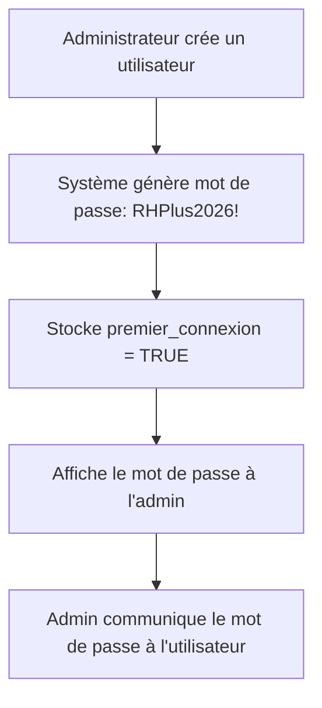
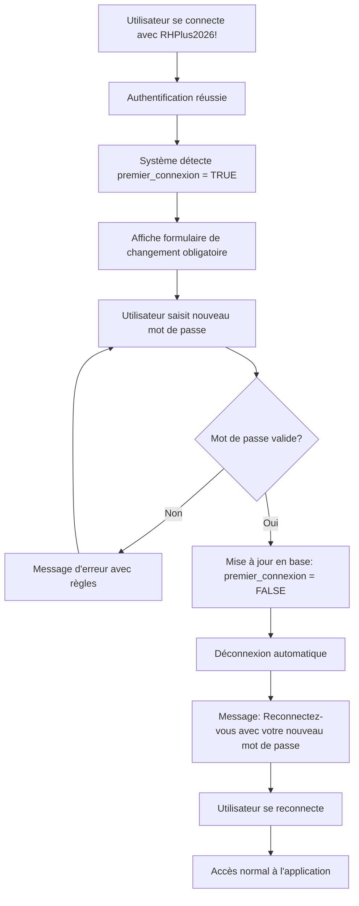

# 🔐 Système de Mot de Passe par Défaut et Première Connexion

## 📋 Vue d'Ensemble

Le système implémente un mécanisme de sécurité où **tous les nouveaux utilisateurs reçoivent un mot de passe par défaut** et sont **obligés de le changer** lors de leur première connexion.

---

## 🎯 Fonctionnalités

### 1. **Mot de Passe par Défaut Unique**
- Mot de passe : `RHPlus2026!`
- Attribué automatiquement à tous les nouveaux utilisateurs
- Affiché à l'administrateur lors de la création du compte

### 2. **Détection de Première Connexion**
- Le système détecte automatiquement si c'est la première connexion
- Bloque l'accès à l'application tant que le mot de passe n'est pas changé

### 3. **Formulaire de Changement Obligatoire**
- Interface moderne et intuitive
- Validation stricte du mot de passe
- Affichage des règles de sécurité
- Option d'affichage/masquage du mot de passe

### 4. **Validation de Sécurité**
- Minimum 8 caractères
- Au moins une majuscule
- Au moins une minuscule
- Au moins un chiffre
- Au moins un caractère spécial
- Interdiction de réutiliser le mot de passe par défaut

---

## 🗄️ Modifications de la Base de Données

### Script SQL : `add_premier_connexion_column.sql`

```sql
-- Ajout de 2 nouvelles colonnes
ALTER TABLE utilisateurs
ADD COLUMN IF NOT EXISTS premier_connexion BOOLEAN DEFAULT TRUE;

ALTER TABLE utilisateurs
ADD COLUMN IF NOT EXISTS mot_de_passe_par_defaut VARCHAR(20) DEFAULT NULL;
```

### Structure Résultante

| Colonne | Type | Description |
|---------|------|-------------|
| `premier_connexion` | BOOLEAN | TRUE si l'utilisateur doit changer son mot de passe |
| `mot_de_passe_par_defaut` | VARCHAR(20) | Stocke le mot de passe par défaut (pour référence admin) |

---

## 💻 Fichiers Créés/Modifiés

### Nouveaux Fichiers

#### 1. **Auth/PasswordGenerator.cs**
Générateur de mots de passe avec validation

**Fonctions principales** :
```csharp
public const string DEFAULT_PASSWORD = "RHPlus2026!";

// Générer le mot de passe par défaut
public static string GenerateDefaultPassword()

// Générer un mot de passe aléatoire (usage futur)
public static string GenerateRandomPassword(int length = 12)

// Valider la force d'un mot de passe
public static bool ValidatePasswordStrength(string password, out string errorMessage)

// Vérifier si c'est le mot de passe par défaut
public static bool IsDefaultPassword(string password)
```

#### 2. **ChangerMotDePasseObligatoireForm.cs**
Formulaire moderne de changement de mot de passe obligatoire

**Caractéristiques** :
- Design moderne avec animations
- Validation en temps réel
- Affichage des règles de sécurité
- Impossible d'annuler sans changer le mot de passe
- Logger les événements dans l'audit trail

#### 3. **Database/add_premier_connexion_column.sql**
Script de migration pour ajouter les colonnes nécessaires

---

### Fichiers Modifiés

#### 1. **AjouterModifierUtilisateurForm.cs**
**Modifications** :
- Utilise `PasswordGenerator.GenerateDefaultPassword()` au lieu de demander un mot de passe
- Définit `premier_connexion = TRUE` lors de la création
- Stocke le mot de passe par défaut dans `mot_de_passe_par_defaut`
- Affiche le mot de passe par défaut à l'administrateur

**Avant** :
```csharp
string passwordHash = PasswordHasher.HashPassword(textBoxMotDePasse.Text);

INSERT INTO utilisateurs
(nom_utilisateur, mot_de_passe_hash, ...)
VALUES (@username, @password, ...)
```

**Après** :
```csharp
string motDePasseParDefaut = Auth.PasswordGenerator.GenerateDefaultPassword();
string passwordHash = PasswordHasher.HashPassword(motDePasseParDefaut);

INSERT INTO utilisateurs
(nom_utilisateur, mot_de_passe_hash, premier_connexion, mot_de_passe_par_defaut, ...)
VALUES (@username, @password, TRUE, @motDePasseDefaut, ...)

// Afficher le mot de passe à l'admin
CustomMessageBox.Show(
    $"Mot de passe par défaut : {motDePasseParDefaut}\n\n" +
    "L'utilisateur devra changer ce mot de passe lors de sa première connexion."
);
```

#### 2. **LoginFormModern.cs**
**Modifications** :
- Ajout de la méthode `EstPremiereConnexion(string nomUtilisateur)`
- Vérification après authentification réussie
- Affichage du formulaire de changement si première connexion
- Déconnexion et re-authentification après changement

**Flux de connexion** :
```csharp
if (success)
{
    if (EstPremiereConnexion(username))
    {
        // Afficher le formulaire de changement
        using (ChangerMotDePasseObligatoireForm formChangeMdp = new ChangerMotDePasseObligatoireForm(username))
        {
            DialogResult result = formChangeMdp.ShowDialog();

            if (result == DialogResult.OK)
            {
                // Déconnecter et demander reconnexion
                SessionManager.Instance.TerminateSession();
                ShowMessage("Veuillez vous reconnecter avec votre nouveau mot de passe");
            }
            else
            {
                // Annulation - déconnecter
                SessionManager.Instance.TerminateSession();
            }
        }
    }
    else
    {
        // Connexion normale
        this.DialogResult = DialogResult.OK;
        this.Close();
    }
}
```

#### 3. **RH_GRH.csproj**
**Ajouts** :
```xml
<Compile Include="Auth\PasswordGenerator.cs" />
<Compile Include="ChangerMotDePasseObligatoireForm.cs">
  <SubType>Form</SubType>
</Compile>
```

---

## 🔄 Flux Utilisateur

### Scénario 1 : Création d'un Nouvel Utilisateur



**Actions administrateur** :
1. Ouvrir **Gestion des Utilisateurs**
2. Cliquer sur **Ajouter un utilisateur**
3. Remplir les informations (nom, email, rôles, etc.)
4. **NE PLUS saisir de mot de passe** (automatique)
5. Cliquer sur **Enregistrer**
6. **Noter le mot de passe affiché** : `RHPlus2026!`
7. Communiquer ce mot de passe de manière sécurisée au nouvel utilisateur

---

### Scénario 2 : Première Connexion d'un Utilisateur



**Étapes utilisateur** :
1. Ouvrir l'application RH+ Gestion
2. Saisir le nom d'utilisateur
3. Saisir le mot de passe par défaut : `RHPlus2026!`
4. Cliquer sur **Connexion**
5. **Formulaire de changement s'affiche automatiquement**
6. Saisir un nouveau mot de passe sécurisé
7. Confirmer le nouveau mot de passe
8. Cliquer sur **Valider et se connecter**
9. Message de succès
10. **Se reconnecter** avec le nouveau mot de passe
11. Accès complet à l'application

---

## 🛡️ Règles de Sécurité du Mot de Passe

### Validation Stricte

Le nouveau mot de passe **DOIT respecter TOUTES** les règles suivantes :

| Règle | Description | Exemple Valide | Exemple Invalide |
|-------|-------------|----------------|------------------|
| **Longueur** | Au moins 8 caractères | `MonMotDePasse2026!` | `Mot123!` (7 caractères) |
| **Majuscule** | Au moins une lettre majuscule (A-Z) | `Password123!` | `password123!` |
| **Minuscule** | Au moins une lettre minuscule (a-z) | `Password123!` | `PASSWORD123!` |
| **Chiffre** | Au moins un chiffre (0-9) | `Password123!` | `PasswordAbc!` |
| **Spécial** | Au moins un caractère spécial | `Password123!` | `Password123` |
| **Non-défaut** | Ne peut pas être `RHPlus2026!` | `MonSecretFort99!` | `RHPlus2026!` |

### Caractères Spéciaux Acceptés
```
! @ # $ % ^ & * ( ) _ + - = [ ] { } | ; : , . < > ?
```

---

## 📊 Messages Utilisateur

### Message Administrateur (Création)
```
L'utilisateur 'jean.dupont' a été créé avec succès !

Mot de passe par défaut : RHPlus2026!

IMPORTANT : L'utilisateur devra changer ce mot de passe lors de sa première connexion.
Veuillez communiquer ce mot de passe de manière sécurisée.
```

### Message Utilisateur (Première Connexion)
```
Première connexion détectée. Changement de mot de passe requis.
```

### Message Succès (Changement)
```
Mot de passe changé avec succès !

Vous pouvez maintenant vous connecter avec votre nouveau mot de passe.
```

### Messages d'Erreur

#### Mots de passe ne correspondent pas
```
Les mots de passe ne correspondent pas
```

#### Mot de passe par défaut réutilisé
```
Vous ne pouvez pas utiliser le mot de passe par défaut.
Veuillez choisir un mot de passe personnel.
```

#### Mot de passe trop faible
```
Le mot de passe doit contenir au moins 8 caractères
```

```
Le mot de passe doit contenir au moins une majuscule
```

```
Le mot de passe doit contenir au moins un caractère spécial (!@#$%^&*...)
```

---

## 🔍 Audit et Traçabilité

### Événements Loggés

Tous les événements sont enregistrés dans la table `logs_audit` :

| Action | Module | Description |
|--------|--------|-------------|
| `UTILISATEUR_CREATE` | Système | Création d'un utilisateur avec mot de passe par défaut |
| `PASSWORD_CHANGE_FIRST_LOGIN` | Sécurité | Changement de mot de passe obligatoire effectué |
| `PASSWORD_CHANGE_ERROR` | Sécurité | Erreur lors du changement de mot de passe |
| `LOGIN_SUCCESS` | Authentification | Connexion réussie après changement de mot de passe |

### Exemple de Log

```sql
INSERT INTO logs_audit (utilisateur_id, nom_utilisateur, action, module, details, resultat, date_action)
VALUES
(15, 'jean.dupont', 'PASSWORD_CHANGE_FIRST_LOGIN', 'Sécurité',
 'Changement de mot de passe obligatoire effectué', 'SUCCESS', NOW());
```

---

## 🧪 Tests

### Test 1 : Création d'Utilisateur
1. ✅ Se connecter comme **Super Administrateur**
2. ✅ Créer un nouvel utilisateur
3. ✅ Vérifier que le mot de passe `RHPlus2026!` est affiché
4. ✅ Vérifier en base : `premier_connexion = TRUE`

### Test 2 : Première Connexion
1. ✅ Se connecter avec le nouvel utilisateur
2. ✅ Utiliser le mot de passe par défaut `RHPlus2026!`
3. ✅ Vérifier que le formulaire de changement s'affiche
4. ✅ Essayer de réutiliser `RHPlus2026!` → Erreur
5. ✅ Saisir un mot de passe valide → Succès
6. ✅ Vérifier la déconnexion automatique
7. ✅ Se reconnecter avec le nouveau mot de passe
8. ✅ Accès complet à l'application

### Test 3 : Reconnexion Normale
1. ✅ Se déconnecter
2. ✅ Se reconnecter avec le mot de passe personnel
3. ✅ Vérifier qu'aucun formulaire de changement n'apparaît
4. ✅ Accès direct à l'application

### Test 4 : Validation du Mot de Passe
1. ✅ Moins de 8 caractères → Rejeté
2. ✅ Sans majuscule → Rejeté
3. ✅ Sans minuscule → Rejeté
4. ✅ Sans chiffre → Rejeté
5. ✅ Sans caractère spécial → Rejeté
6. ✅ Avec toutes les règles → Accepté

---

## 🔧 Dépannage

### Problème : L'utilisateur ne peut pas se connecter après création

**Solution** :
1. Vérifier que la colonne `premier_connexion` existe dans la table `utilisateurs`
2. Exécuter le script : `Database/add_premier_connexion_column.sql`
3. Recréer l'utilisateur

### Problème : Le formulaire de changement ne s'affiche pas

**Diagnostic** :
```sql
SELECT premier_connexion, mot_de_passe_par_defaut
FROM utilisateurs
WHERE nom_utilisateur = 'nom_utilisateur';
```

**Solution** :
```sql
UPDATE utilisateurs
SET premier_connexion = TRUE,
    mot_de_passe_hash = SHA2('RHPlus2026!', 256),
    mot_de_passe_par_defaut = 'RHPlus2026!'
WHERE nom_utilisateur = 'nom_utilisateur';
```

### Problème : Mot de passe réinitialisé mais l'utilisateur l'a oublié

**Solution Admin** :
```sql
-- Réinitialiser au mot de passe par défaut
UPDATE utilisateurs
SET premier_connexion = TRUE,
    mot_de_passe_hash = SHA2('RHPlus2026!', 256),
    mot_de_passe_par_defaut = 'RHPlus2026!',
    compte_verrouille = FALSE,
    tentatives_echec = 0
WHERE nom_utilisateur = 'nom_utilisateur';
```

Communiquer `RHPlus2026!` à l'utilisateur pour qu'il se reconnecte.

---

## 📝 Bonnes Pratiques

### Pour les Administrateurs

1. **Communication Sécurisée**
   - Ne jamais envoyer le mot de passe par email non chiffré
   - Utiliser un canal sécurisé (en personne, téléphone, plateforme chiffrée)
   - Ne pas noter le mot de passe sur papier visible

2. **Gestion des Accès**
   - Créer les comptes juste avant que l'utilisateur en ait besoin
   - Vérifier que l'utilisateur change son mot de passe dans les 24h
   - Désactiver les comptes non utilisés

3. **Audit Régulier**
   - Vérifier les logs de changement de mot de passe
   - Identifier les comptes avec `premier_connexion = TRUE` depuis longtemps
   - Contacter les utilisateurs qui n'ont pas changé leur mot de passe

### Pour les Utilisateurs

1. **Choix du Mot de Passe**
   - Utiliser une phrase secrète mémorable : `MonChat$Aime#LesPoissons2026!`
   - Ne pas réutiliser de mots de passe d'autres services
   - Ne pas noter le mot de passe en clair

2. **Sécurité**
   - Changer le mot de passe immédiatement après réception
   - Ne jamais partager son mot de passe
   - Se déconnecter après utilisation

---

## 🚀 Installation/Mise à Jour

### Étape 1 : Exécuter le Script SQL

```bash
# Via ligne de commande MySQL
mysql -u root -p rhplusCshrp < Database/add_premier_connexion_column.sql

# Ou via phpMyAdmin
# Copier-coller le contenu du fichier dans l'onglet SQL
```

### Étape 2 : Recompiler l'Application

```bash
cd "C:\Users\aaron\Pojet GMP RH\Rhplus_Gestion"
MSBuild RH_GRH.sln -t:Rebuild -p:Configuration=Release
```

### Étape 3 : Tester

1. Créer un utilisateur test
2. Noter le mot de passe par défaut affiché
3. Se connecter avec le compte test
4. Valider le flux de changement de mot de passe

---

## 📦 Fichiers du Système

```
Rhplus_Gestion/
├── Database/
│   └── add_premier_connexion_column.sql       # Script de migration
├── RH_GRH/
│   ├── Auth/
│   │   └── PasswordGenerator.cs               # Générateur de mots de passe
│   ├── ChangerMotDePasseObligatoireForm.cs    # Formulaire de changement
│   ├── LoginFormModern.cs                      # Login avec détection
│   ├── AjouterModifierUtilisateurForm.cs      # Création avec mot de passe par défaut
│   └── RH_GRH.csproj                           # Fichier projet
└── SYSTEME_MOT_DE_PASSE_PAR_DEFAUT.md         # Cette documentation
```

---

**Version** : 1.0
**Date** : 12 février 2026
**Auteur** : Équipe RH+ Gestion
**Statut** : ✅ Implémenté et Compilé

